# Block-based coding features

Flock XR is based on the Blockly library and provides structured coding where programs are constructed from useful blocks. The available blocks can be discovered from a toolbox with categories and each block represents a useful concept.

Flock XR has lots of features in common with other blockly-based coding tools such as Scratch, MakeCode and code.org. But it has lots of custom behaviour too.

Custom behavior is mostly for the following reasons:

- **Accessibility and mobile support.** Flock XR has a focus on accessibility and mobile user experience. This has led us to customisations that make it easier to work with blocks on small screens and on touch screens.
- **Progression to text-based coding.** Experienced users sometimes find block-based coding slower for some tasks, but this may happen when block-based coding is still the right choice. We've added features like content-assist and additional keyboard controls to help with this.
- **Integration with the 3D canvas.** In Flock XR objects can be edited with visual gizmos which also update the corresponding Blockly block.

In this doc we'll go through the additional features that Flock XR has as well as highlighting some Blockly features that not all block-based editors use and might be less familiar.

## Themes

Flock XR has a choice of themes for the workspace:

- **Light**: The default
- **Dark**: A dark mode for users who prefer it
- **Contrast**: A dark mode designed for high contrast for visual impairment
- **Low color**: A mostly black and white mode with icons instead of block colors.

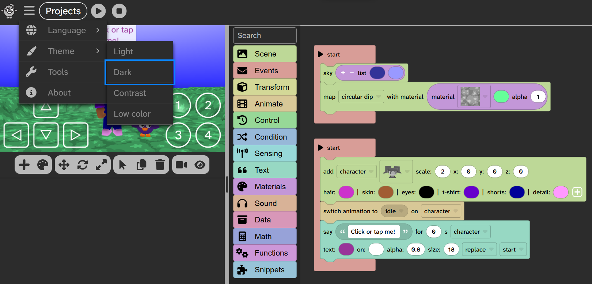

All themes use the Atkinson Hyperlegible font which has been designed for visually impaired users and makes clear distinctions between similar letters and numbers.

## Auto vertical code layout

In Flock XR, code is laid out top to bottom and this happens automatically when you change blocks. Some of the blocks in Flock XR are quite wide so there's not much benefit in having multiple columns of blocks. Auto-layout means that you spend less time laying out code and have more time to focus on coding. It's also helpful for progression to text-based coding, but that's not the primary reason. It also makes the order in which scripts are started well-defined.

Blocks that are not attached to a top-level container block can be dropped on the workspace and stay on top. This is helpful when you are rearranging blocks.

## Block tools

When you click/tap on a block, or press H when using keyboard controls, a block tools menu appears above the block. This makes it easier to access block actions than using the context menu. The feature was originally added for mobile users where tap and hold is a difficult gesture for some users. But it was very useful for discoverability and ease of access on the desktop too.

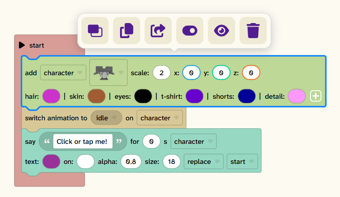

If you open the block menu with the H keyboard control then other keyboard controls are also shown.

## Block info

Instead of hover block info which is not visible on mobile devices, Flock XR uses block info popups. These can be turned on or off from the info icon in the workspace bottom toolbar. When turned on, selecting a block will also show the block info.

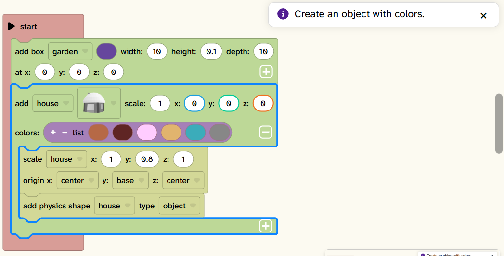

## Keyboard controls

Flock XR builds on Blockly's support for keyboard navigation. Projects can be fully authored using keyboard controls. This extends to the full editor including the overall UI and the visual gizmos and color picker. Flock XR also has additional keyboard shortcuts for common actions.

## Context-aware add

If you select a block and then paste, the pasted blocks will be added after the selected block where appropriate. This reduces the number of actions needed when copying or reorganising code.

Clicking or tapping a block in the toolbox will also append/insert to the current selection where appropriate.

## Avoid accidental drag on mobile

We found that it was too easy to accidentally drag blocks on mobile phones. In Flock XR, if you're on a small device then you need to tap a block to select it before you can drag it. This makes it easier to scroll the workspace without accidentally moving blocks around.

The same rule applies to the toolbox: on a small device, tap a block in the toolbox to select it first, then tap again or drag to add it to the workspace. This stops blocks being added accidentally while scrolling through the toolbox.

## Expand/collapse

Expand and collapse are standard Blockly features which Flock XR enables. They are really helpful for tidying up big projects so you can keep your focus on new code. We have customised the collapsed version of the block in some cases to be more helpful for specific blocks in Flock XR.

## Enable/disable

Enable/disable is a standard Blockly feature that allows blocks to be ignored when the project is running. This is really useful for debugging and experimenting.

## Inputs get bigger on edit

When you are editing a text or number input in Flock XR, the font size gets bigger. This helps with focus and visibility.

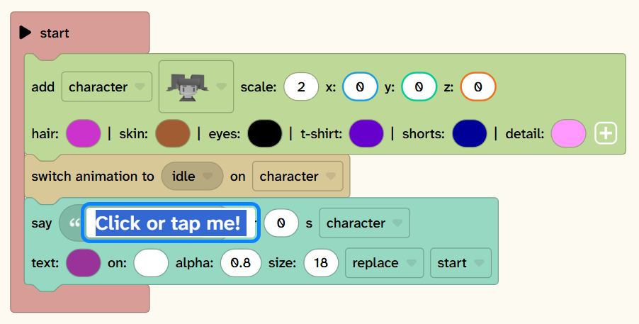

## Lists

Flock XR uses the plus/minus lists plugin with some additions. You can get a list of numbers, text or colors from the toolbox. You can drag and drop list items to swap the order. Text join blocks behave in a similar way.

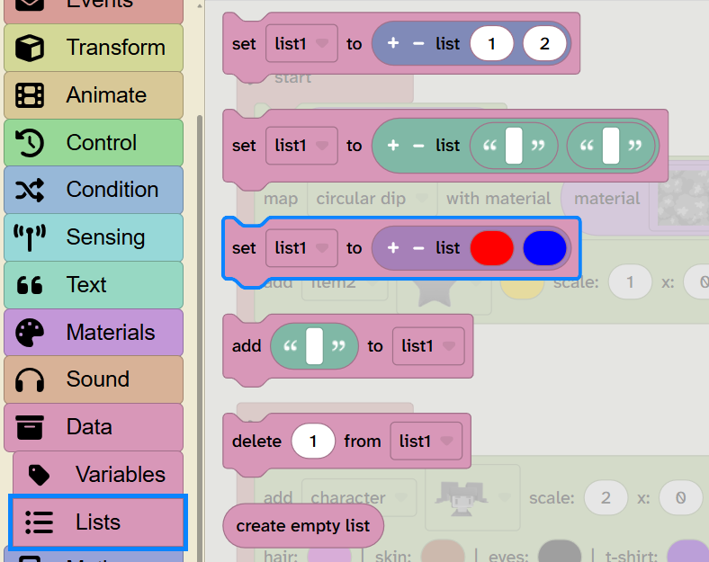

## Lock/unlock

You can lock blocks so that they can't be edited or moved around. This was originally an accessibility feature for users that have fine motor control challenges. But it's also useful for educators who want to create starter projects with code that shouldn't be deleted or modified. It can be used for parts of a project that are finished and you don't want to accidentally change.

Lock/unlock is available from the context menu (right click or tap and hold).

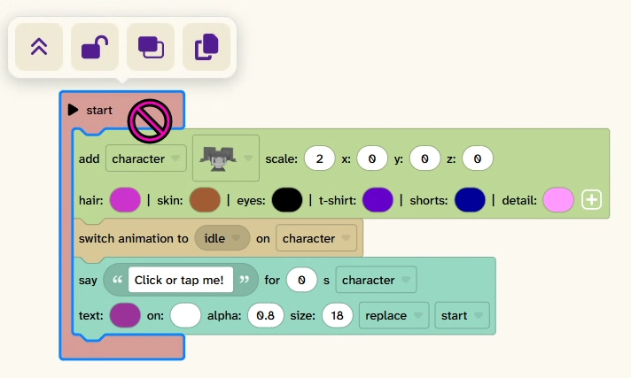

## Comments

Flock XR has an inline comment block instead of the sticky note style block comments. This allows comments to be read naturally as part of the code and avoids layout issues with the note comments. It also supports progression onto text-based coding. Workspace comments are still available.

## Toolbox search

Flock XR includes the Blockly toolbox search plugin with some customisations. If you are in the toolbox then Ctrl + F will move focus to the toolbox search box.

## Workspace search

Flock XR includes the Blockly workspace search plugin with some customisations. If you are on the workspace, then Ctrl + F opens the workspace search box. You can also open workspace search using the magnifying glass icon from the workspace bottom menu bar.

## Trashcan

The trashcan is a Blockly feature. Many people don't realise you can get deleted blocks back from the trashcan. This works even if you deleted them with the Delete key or by dragging them to the toolbox.

In Flock XR, blocks stay in the trashcan when you load a different project which can be useful.

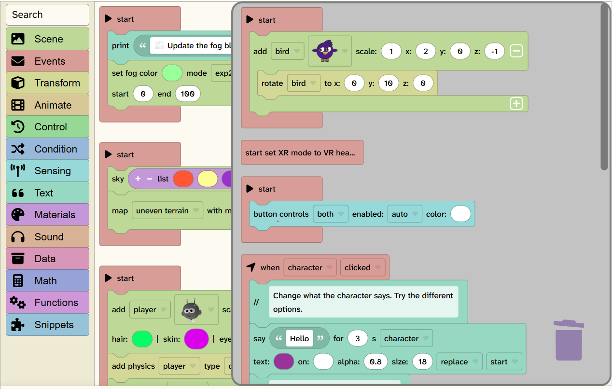

## Type a block

You can use Ctrl + . to add a block after the current block. Then start typing and choose from matching blocks. This means that you don't have to move away from your code to add a new block. This can be a faster way to work for experienced users and for keyboard users.

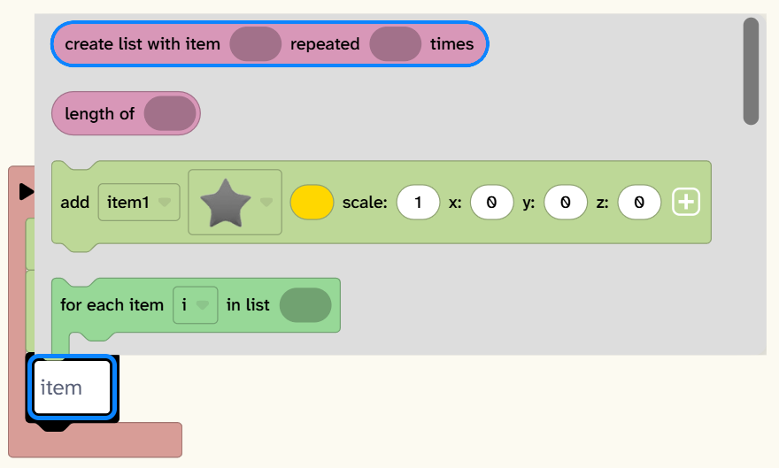

## Workspace zoom

You can use the workspace bottom bar buttons to zoom in and out on the workspace. Use this when you just want the blocks to be bigger when working on them or sharing with a class on a smartboard or projector.

Use the zoom feature of your browser, usually Ctrl+ and Ctrl- to zoom the whole interface.

## Color-picker gizmo

Our early users wanted more choice of colors. The color picker can be used to color objects or parts on the canvas, this will update the corresponding Blockly block. You can also choose a color and then select a Blockly color block to apply it (if available in your browser). The color picker is also designed for keyboard operation.

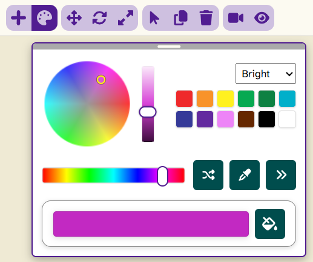

## Snippets

Snippets are reusable groups of blocks. Commonly used snippets are available from the toolbox. You can also save a snippet to your computer from the context menu. You can load snippets in from the workspace context menu. This is really handy for sharing code between projects, or placing reusable snippets for a lesson on a shared drive.

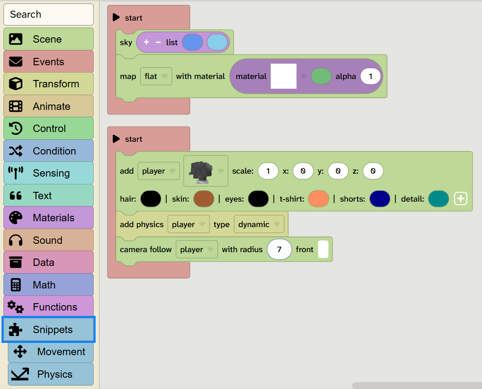

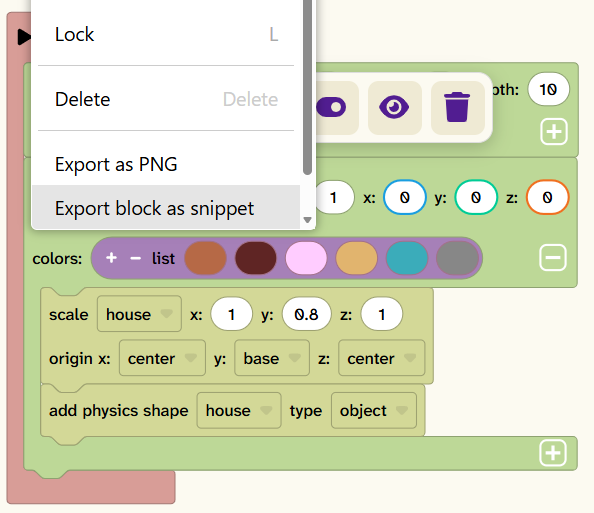

## Sections

Sections are container blocks that you can place other top-level blocks inside. This makes it easier to organise code by putting related scripts together. This is often called good modularity in computer programming.

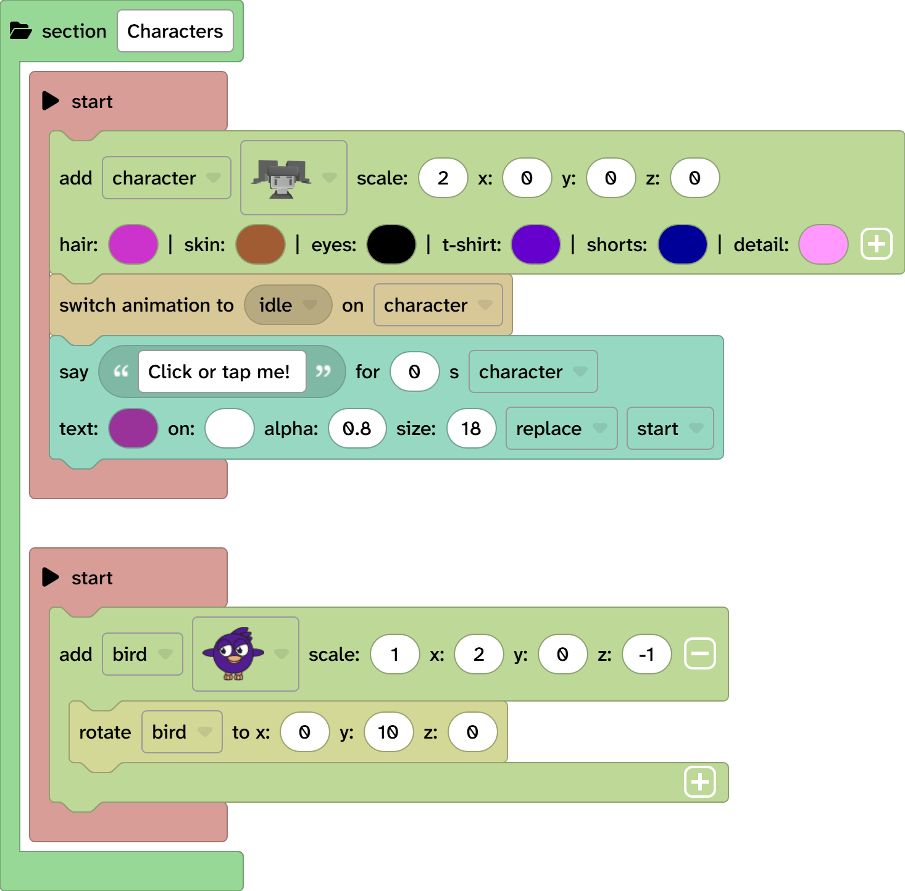

## Variables

Variables for add blocks are added automatically and incremented when a new block is added. Toolbox blocks that use variables default to the most recently added variable.

In Blockly, variables are global. There are some situations where you want a variable to be local to a particular instance of the code - for example you might be processing multiple events at the same time and each one needs its own variables. Blockly already does this for you for functions. Flock XR allows you to use local variables in other places.

## Inline functions and top-level blocks

In Flock XR you can click on the arrow on some top-level blocks to allow them to be placed in a stack. This can be used with local variables to give an 'on event' block access to locally scoped variables.

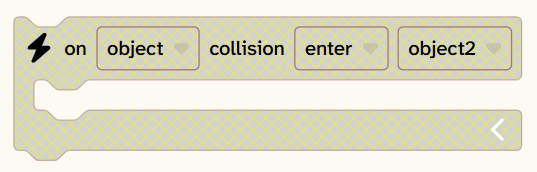

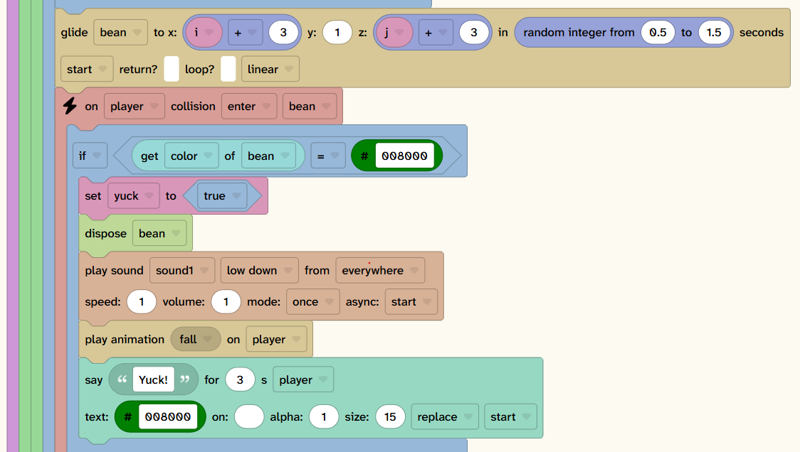

## Export as image

You can export an image of a block (and its contained blocks) from the context menu. If you choose a statement block then the image will contain the blocks below it in the stack.

You can import an image back in to reuse the code. This is useful for sharing code snippets with students or putting them on a website.

## If/else blocks

We tried various options for if/else if/else blocks and we didn't get good user feedback on any of them. So we designed new blocks with separate branches. You can join these together into valid combinations. It's easy to cut and paste them. And you can easily switch between if/else if/else with a dropdown. This is working well for common situations such as having multiple similar conditions to check.

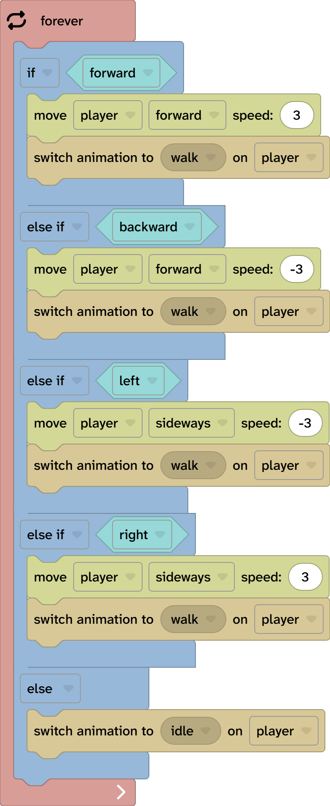

## Add blocks

Add blocks in Flock XR add new objects to the 3D world. You can add blocks that run before the object is added to the scene - this might be rotating the object or starting an animation. You can also add blocks that run after the block is added to the scene - this could be gliding the block to a new position or saying some text.
